# ODIN 2.0 — User Manual

> **ODIN 2.0** — Dynamic Cost Optimizer for heat pumps. This guide walks you through first boot, the setup wizard, the complete dashboard, and every setting of the ODIN 2.0 device.

ODIN 2.0 is the standalone optimizer. It talks to your heat pump **directly over MQTT**. A pump-side device (Asgard or HeishaMon) bridges the heat pump bus to MQTT; ODIN does all forecasting, physics learning and planning on itself, and sends commands back to the pump.

---

## Table of Contents

1. [What You Need](#1-what-you-need)
2. [Known Limitations & Expectations](#2-known-limitations--expectations)
3. [License & Usage Conditions](#3-license--usage-conditions)
4. [First Boot — Wi-Fi Setup](#4-first-boot--wi-fi-setup)
5. [Setup Wizard](#5-setup-wizard)
6. [Navigating the Dashboard](#6-navigating-the-dashboard)
7. [Settings — MQTT](#7-settings--mqtt)
8. [Settings — Heat Pump](#8-settings--heat-pump)
9. [Settings — Location & Weather](#9-settings--location--weather)
10. [Settings — Price](#10-settings--price)
11. [Settings — Schedule](#11-settings--schedule)
12. [Settings — DHW & Legionella](#12-settings--dhw--legionella)
13. [Settings — Solar](#13-settings--solar)
14. [Monitoring — Optimization, Physics & Charts](#14-monitoring--optimization-physics--charts)
15. [Data Tab](#15-data-tab)
16. [System Tab](#16-system-tab)
17. [The Pump Side — Asgard & HeishaMon](#17-the-pump-side--asgard--heishamon)
18. [How the Optimizer Works](#18-how-the-optimizer-works)
19. [API Data Feeds — Pushing Prices & Weather](#19-api-data-feeds--pushing-prices--weather)
20. [MQTT Integration](#20-mqtt-integration)
21. [Quick-Start Checklist](#21-quick-start-checklist)
22. [Factory Reset](#22-factory-reset)

---

## 1. What You Need

- **ODIN hardware**
- **A pump-side MQTT device**: either **Asgard** or **HeishaMon**. It must be connected to the **same MQTT broker** ODIN uses, or reachable through the **HP Command URL** HTTP fallback.
- A representative **room temperature source**. ODIN plans against the actual measured room temperature.
- A browser to complete initial setup
- Your location coordinates (latitude / longitude) — the setup wizard has an interactive map
- Basic knowledge of your house: heating system type, solar panel capacity (if any), heat pump rated output

> **Note:** ODIN is a standalone, local device — it requires no cloud subscription or external account. All computation runs on the device itself. It does retrieve time, weather and energy prices from the internet.

---

## 2. Known Limitations & Expectations

While ODIN is highly advanced, it is important to set the right expectations regarding what the system can and cannot do:

- **External API Dependency:** For fully automatic operation, ODIN relies on third-party servers for weather forecasts (e.g., Open-Meteo) and electricity prices (e.g., ENTSO-E). While multiple sources are supported, these external services can change their data structures, experience downtime, or alter their free tiers outside of our control. *Mitigation:* ODIN features built-in manual API endpoints (see [Section 19](#19-api-data-feeds--pushing-prices--weather)). You can push your own data locally (e.g., via Home Assistant), ensuring ODIN will always work regardless of what happens to the public APIs.
- **Solar Forecast Inaccuracy:** Solar production is calculated using weather predictions, which cannot be 100% accurate. Passing clouds, unexpected haze, or partial panel shading can cause the actual yield to be lower than the forecast. *Mitigation:* Use the **Solar Min. Ratio** parameter (see [Section 13](#13-settings--solar)) to require a safety buffer (e.g., 120%–150%) before ODIN assumes heating is genuinely powered by free solar.
- **Human Factors & Unpredictable Heat Gains:** The solver learns your house's thermal behavior over time, but it cannot predict human actions. Opening windows for an hour, lighting a fireplace, cooking a large meal, or hosting a party will alter the room temperature in ways the model could not anticipate. ODIN will notice the deviation and adjust the plan for the *next* hour.
- **Hardware Overrides:** ODIN optimizes the schedule, but it cannot override the heat pump's physical safety limits or hard-coded triggers. For instance, if someone takes a very long shower and the DHW tank temperature hits the physical drop point, the heat pump will start immediately to recover the DHW tank, regardless of ODIN's cost plan.
- **Telemetry Source:** All measured data (temperatures, energy counters, operation mode) arrives from the pump-side device over MQTT. If that device goes offline or its telemetry goes stale (see **Telemetry Stale Timeout**), ODIN excludes the heat pump from the plan and keeps the last plan in effect.
- **Coarse Energy Counters (FTC5 / FTC4, firmware > 12.01):** those controllers do not report real-time energy; the pump's counters only update daily, so hourly consumption per mode becomes inaccurate. *Mitigation:* set Asgard's **Energy Meter Source** to `Home Assistant or REST API` and feed a real energy meter — ODIN then counts its buckets from the meter instead of the internal counter (see [Section 17](#17-the-pump-side--asgard--heishamon)).
- **High Resolution Temperature Sensor:** It is recommended to use a temperature sensor with a **0.1°C** resolution. ODIN will be able to observe temperature changes faster and react accordingly.

---

## 3. License & Usage Conditions

ODIN is provided under a strict home-use agreement. By using the ODIN software and hardware, you agree to the following terms and conditions:

- **Personal / Home Use Only:** The system is intended strictly for private, residential use to optimize personal energy consumption.
- **No Commercial Use:** You may not use ODIN for any commercial purposes. This includes, but is not limited to, managing commercial properties, industrial applications, charging clients for optimization services, or reselling the hardware/software package as part of a commercial installation service.
- **Disclaimer of Liability:** The creators of ODIN are not responsible for any damages to your property, heating system, or home caused by using this software. Users are required to actively monitor the system to ensure it is behaving correctly and safely. Please be extra vigilant **especially when cooling**, as improper cooling operation can lead to severe condensation and water damage.
- **Limited Warranty:** A **1-year warranty** is provided against **hardware** manufacturing defects.
   * **Exclusions:** The warranty is **VOID** if failure is caused by user error, such as:
   * Physical modification or soldering by the user.
   * Water damage
   * **Accidental damage (e.g. dropping the unit, cracking the 3D printed casing).**

---

> [!TIP]
> **Optimal Placement:** To ensure a stable connection, place your Odin unit near a Wi-Fi access point or router. Due to its low power consumption, Odin can be conveniently powered directly from a spare USB port on your router or NAS.

> [!IMPORTANT]
> **Assign a Static IP Address:** For optimal reliability, please configure a static (fixed) IP address for your Odin unit. You can typically do this in your router's settings by creating a DHCP reservation using Odin's MAC address.

## 4. First Boot — Wi-Fi Setup

When ODIN boots for the first time (or after a Wi-Fi reset), it cannot connect to your home network yet. It creates its own temporary access point so you can configure it.

### Step 1 — Connect to the ODIN access point

On your phone or laptop, open Wi-Fi settings and look for a network named:

```
Odin_Setup
```

Connect to it. No password is required. The status LED is **solid blue** while the device is in AP mode (solid red means it is trying, but failing, to connect to a saved network).

### Step 2 — Set up Wi-Fi

ODIN serves its full dashboard even in access-point mode. Open a browser and go to:

[http://192.168.4.1](http://192.168.4.1)

Open the **System** tab and fill in the **Wi-Fi** card with your network's **SSID** and **Password**, then click **Save & Reboot**.

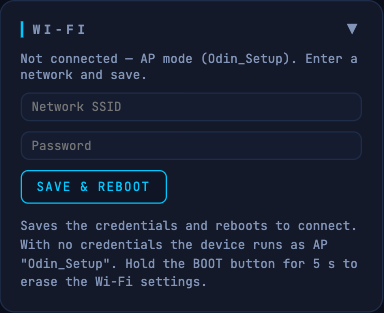

### Step 3 — Find ODIN on your network

ODIN joins your home network and the access point disappears. It is now accessible via the IP address your router assigned to it — find it in your router's connected devices list, or try:

```
ping odin.local
```

> **Tip:** Assign a static IP to ODIN in your router settings so the address never changes.

---

## 5. Setup Wizard

The setup wizard is a guided 6-step process, opened at `http://<odin-ip>/setup`. Run it once after [First Boot](#4-first-boot--wi-fi-setup); you can re-open it at any time later. It collects the minimum configuration needed before ODIN can start optimizing.

The wizard pre-fills any values already stored in ODIN's configuration, so re-running it is safe and non-destructive.

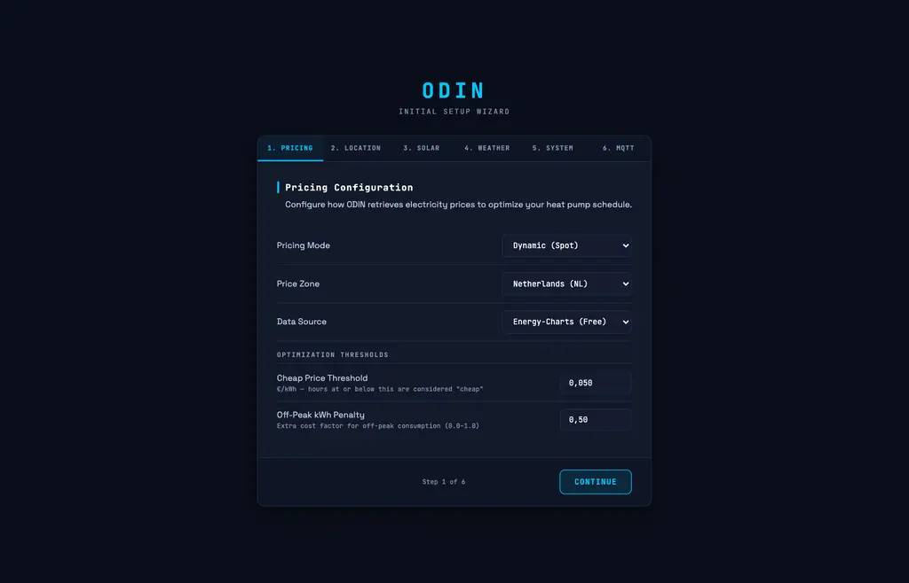

### Step 1 — Pricing Configuration

Configure how ODIN retrieves electricity prices.

| Field | Description |
|-------|-------------|
| **Pricing Mode** | `Dynamic (Spot)` uses hourly day-ahead market prices. `Fixed Rate` uses a flat price you enter manually. |
| **Price Zone** | Your electricity market region (see the full zone list in [Section 10](#bidding-zone)). |
| **Data Source** | `Energy-Charts (Free)` requires no account. `ENTSO-E (Requires Token)` uses the official European exchange data and requires a free API token. `External API (HTTP POST)` disables automatic fetching — prices are pushed to ODIN from an external system (see [Section 19](#19-api-data-feeds--pushing-prices--weather)). |
| **ENTSO-E API Token** | Only shown when ENTSO-E is selected. Format: `xxxxxxxx-xxxx-xxxx-xxxx-xxxxxxxxxxxx`. Get one free at [transparency.entsoe.eu](https://transparency.entsoe.eu). |
| **Cheap Price Threshold** | Hours at or below this price are considered "cheap" and attract pre-heating (see [Section 10](#cheap-price-kwh)). |
| **Off-Peak kWh Penalty** | Extra cost factor applied to grid consumption during non-cheap hours (0.0–1.0). |

### Step 2 — Geographical Location

Drag the marker or click the map to set your location. ODIN uses this for the weather forecast, the solar position calculation and timezone detection. The latitude and longitude fields below the map update automatically as you move the marker.

> **Why this matters:** An incorrect location gives wrong solar irradiance data, which causes ODIN to over- or under-estimate how much of the heat pump's load your panels are covering.

### Step 3 — Solar PV System

Toggle **I have solar panels** on if you have a PV installation. Define one card per physical array with the `+ Add Array` button:

| Field | Description |
|-------|-------------|
| **Capacity (kWp)** | The peak output of this array in kilowatts-peak. |
| **Orientation (Degrees)** | The compass direction your panels face, in degrees (0 = North, 90 = East, 180 = South, 270 = West). |
| **Tilt / Pitch (Degrees)** | The angle your panels are mounted at. Flat roof = ~10°, pitched roof = ~35–45°. |
| **Efficiency (PR)** | Performance ratio — inverter, cable, soiling and temperature losses. Typical 0.82. |

Under **Solar Behavior**:

- **Solar-Only Cooling** — only run cooling mode when solar covers the load.
- **Min Solar Coverage for HP (%)** — percentage of the HP load that must come from solar before the solver may import cheap grid power (0 = off).

If you have no solar panels, leave the toggle off. ODIN will still optimize around price. Please be advised that solar production is an **estimation** based on the parameters.

### Step 4 — Weather Data Source

ODIN uses outdoor temperature and solar irradiance forecasts for heat-loss modeling and solar yield prediction.

| Field | Description |
|-------|-------------|
| **Weather Source** | `Open-Meteo (Free)` requires no key for the free tier. `Visual Crossing` requires a free API key. `Manual API (HTTP POST)` disables automatic fetching — weather data must be pushed to ODIN from an external system. |
| **Open-Meteo API Key** | Optional — leave empty for the free tier. |
| **Visual Crossing API Key** | Required when Visual Crossing is selected. Get one free at [visualcrossing.com](https://www.visualcrossing.com). |

### Step 5 — Heat Pump Specifications

Enter the thermal limits of your heat pump so the solver can plan realistic loads:

| Field | Description |
|-------|-------------|
| **Max Thermal Capacity (kW)** | Absolute maximum output — check your heat pump's datasheet for the value at 7°C. |
| **Min Modulation (kW)** | Lowest stable output — typically 20–35% of max. Below this level, the HP cycles on/off instead of modulating smoothly. |

### Step 6 — MQTT Connectivity

ODIN talks to your heat pump through an MQTT broker — the pump-side device (Asgard or HeishaMon) **must be connected to the SAME broker**, or commands never reach the pump. No broker in your network? ODIN can run one itself — point the pump-side device and Home Assistant at the ODIN's IP address instead.

| Field | Description |
|-------|-------------|
| **Broker Mode** | `Use existing broker on the network` or `ODIN runs its own broker (none needed) Recommended for Asgard installations`. |
| **Broker Address** | IP or hostname of the MQTT broker the heat pump is connected to. Fixed at port **1883** when ODIN runs its own broker. |
| **Username / Password** | Optional broker credentials. Default Odin bundled MQTT broker credentials: **odin-user** / **odin-pwd** |
| **Topic Prefix** | Namespace prefix for all device topics (default `hp`). |
| **HP Command URL** | Optional HTTP alternative to MQTT (see [Section 7](#7-settings--mqtt)). |

Click **Finish & Save**. ODIN saves all settings and opens the main dashboard; the first plan is computed with the next hourly solve.

---

## 6. Navigating the Dashboard

The dashboard has four tabs at the top:

| Tab | Purpose |
|-----|---------|
| **Monitoring** | Live plan, heat pump telemetry, physics data, 24h charts and the decision calendar |
| **Settings** | All configuration — MQTT, Heat Pump, Location & Weather, Schedule, Price, DHW, Solar |
| **Data** | The raw 48h price and weather curves ODIN is working with |
| **System** | Device info, Wi-Fi, backups, firmware updates and logs |

The header shows live badges (heat pump connectivity, operation mode, current plan). On the **Settings** tab you can **drag the cards to reorder** them, and collapse any card with its header.

---

## 7. Settings — MQTT

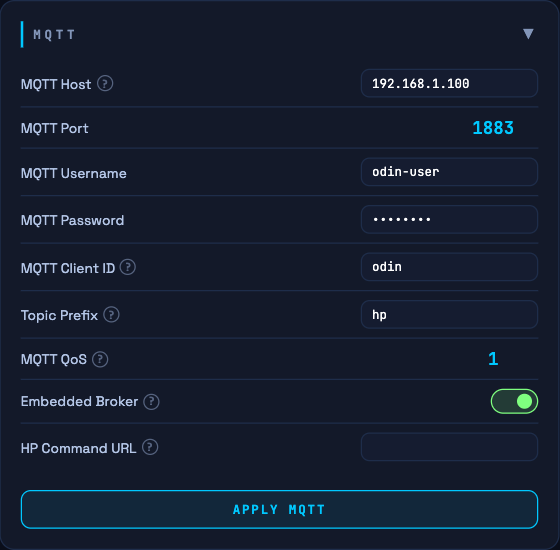

| Field | Description |
|-------|-------------|
| **MQTT Host** | The MQTT broker ODIN publishes telemetry to and takes commands from. The pump-side device (e.g. Asgard/HeishaMon) must be connected to the **same** broker — commands sent to a broker it does not listen on are silently lost. Ignored when the embedded broker is on. |
| **MQTT Client ID** | MQTT client identifier (unique per device). Default `odin`. |
| **Topic Prefix** | Namespace prefix for all device topics (default `hp`). |
| **MQTT QoS** | 0 = at most once, 1 = at least once, 2 = exactly once. Default `1`. |
| **Embedded Broker** | Run the MQTT broker on the ODIN itself (port 1883) — no separate broker needed anywhere. ODIN then talks to its own broker, and the pump-side device and Home Assistant must be pointed at this ODIN's IP as their broker. Takes effect after reboot. |
| **HP Command URL** | Optional HTTP alternative to MQTT (the HeishaMon/Asgard address, without the `/command` path). Commands are POSTed there **first** and fall back to MQTT. Useful when the pump-side device cannot join ODIN's broker. Takes effect after reboot. |

The full topic layout is documented in [Section 20](#20-mqtt-integration).

---

## 8. Settings — Heat Pump

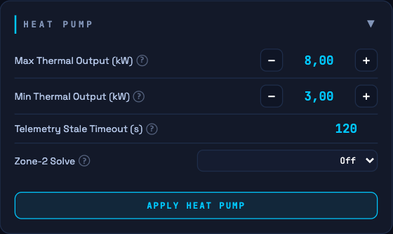

### Max Thermal Output (kW)

The absolute maximum thermal output your heat pump can deliver. The solver will never plan heat input above this value.

**How to set it:** Use the rated output at the typical outdoor temperature from your heat pump's datasheet.

| HP nameplate | Typical max output |
|--------------|-------------------|
| 5–7 kW | 6.0–7.0 kW |
| 9–12 kW | 8.0–11.0 kW |
| 14–16 kW | 12.0–15.0 kW |

> **Tip — using Max Output as a soft cap:** Setting this lower than your heat pump's physical maximum intentionally limits how hard it runs. For example, setting 7 kW on a 10 kW heat pump means ODIN will never plan more than 7 kW of heat per hour. This is useful for reducing noise at night or spreading peak electricity load.

### Min Thermal Output (kW)

The lowest thermal output your heat pump can sustain before the compressor shuts off entirely. Below this level, the heat pump cycles on and off rather than modulating continuously.

**Why it matters:** The solver uses this as a dead zone — it will never plan output between 0 and this value. This avoids short-cycling the compressor, which wastes energy and causes wear.

| HP model type | Typical min modulation |
|--------------|----------------------|
| Small modulating (4–6 kW) | 1.5–2.5 kW |
| Medium (7–12 kW) | 2.0–3.5 kW |
| Large (14–16 kW) | 3.0–5.0 kW |

### Telemetry Stale Timeout (s)

Telemetry older than this marks the heat pump **stale**; stale pumps are excluded from the plan. Raise it if your pump-side device publishes slowly; lower it if you want ODIN to react faster to a dead bridge.

### Zone-2 Solve (select)

For heat pumps that can run **two independently controllable zones** (each zone with its own thermostat and setpoint — for example a ground floor and an upper floor), ODIN plans both zones. There is still only one compressor, so the zones share one capacity budget: the zone that plans first gets the full compressor capacity and the DHW slot, and the other zone plans on whatever capacity is left, hour by hour.

| Option | Meaning |
|--------|---------|
| **Off** (default) | No override — the single-zone solve runs; zone 2 is not planned. |
| **Zone 1 first** | Zone 1 plans first with full compressor capacity and the DHW slot; Zone 2 runs on residual capacity. |
| **Zone 2 first** | Zone 2 plans first with full compressor capacity and the DHW slot; Zone 1 runs on residual capacity. |

> **Note:** This only has an effect when the pump reports independently controllable zone temperatures. Without that signal ODIN plans a single zone and this selection is ignored. The direction is a property of the installation — choose it once. If one zone pass fails, ODIN degrades to the single-zone plan rather than to no plan at all.

---

## 9. Settings — Location & Weather

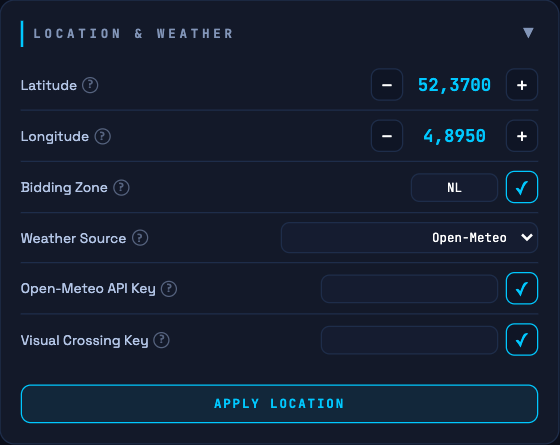

### Latitude / Longitude

Your geographic coordinates in decimal degrees. Essential for solar irradiance and weather forecasts.

**How to find them:** Search your address on [maps.google.com](https://maps.google.com), right-click your location, and the coordinates appear at the top of the context menu.

**Examples:** `52.3702`, `4.8952` for Amsterdam.

> **Tip:** Use the Setup Wizard's interactive map for easy coordinate entry — just drag the pin to your house.

### Bidding Zone

Selects your electricity market zone, which determines which day-ahead market data is fetched and which energy tax and VAT rates apply. All prices shown in the dashboard are **all-in consumer prices** — spot price plus applicable energy tax plus VAT — calculated using the rates for the selected zone.

#### Benelux

| Zone | Country / Region | Energy Tax | VAT |
|------|-----------------|-----------|-----|
| `NL` | Netherlands | EB + ODE (€0.109/kWh) | 21% |
| `BE` | Belgium | Excise duty (€0.050/kWh) | 6% |

#### Germany / Austria / Switzerland

| Zone | Country / Region | Energy Tax | VAT |
|------|-----------------|-----------|-----|
| `DE-LU` | Germany & Luxembourg | Stromsteuer (€0.041/kWh) | 19% |
| `DE-AT-LU` | Germany / Austria / Luxembourg (legacy zone) | Stromsteuer (€0.041/kWh) | 19% |
| `AT` | Austria | Elektrizitätsabgabe (€0.015/kWh) | 20% |
| `CH` | Switzerland | None | 8.1% |

#### France & Iberia

| Zone | Country / Region | Energy Tax | VAT |
|------|-----------------|-----------|-----|
| `FR` | France | TICFE (€0.033/kWh) | 20% |
| `ES` | Spain | Impuesto electricidad (€0.005/kWh) | 21% |
| `PT` | Portugal | Imposto especial consumo (€0.001/kWh) | 23% |

#### British Isles

| Zone | Country / Region | Energy Tax | VAT |
|------|-----------------|-----------|-----|
| `GB` | Great Britain | None | 5% |
| `IE` | Ireland | Electricity tax (€0.001/kWh) | 9% |

#### Scandinavia & Finland

| Zone | Country / Region | Energy Tax | VAT |
|------|-----------------|-----------|-----|
| `DK1` | Denmark (West) | Elafgift (€0.100/kWh) | 25% |
| `DK2` | Denmark (East) | Elafgift (€0.100/kWh) | 25% |
| `FI` | Finland | Sähkövero Class I (€0.023/kWh) | 25.5% |
| `SE1` | Sweden (North) | — (via grid operator) | 25% |
| `SE2` | Sweden (North-Central) | — (via grid operator) | 25% |
| `SE3` | Sweden (South-Central) | — (via grid operator) | 25% |
| `SE4` | Sweden (South) | — (via grid operator) | 25% |
| `NO1` | Norway (East) | — (via grid operator) | 25% |
| `NO2` | Norway (South-West) | — (via grid operator) | 25% |
| `NO3` | Norway (Central) | — (via grid operator) | 25% |
| `NO4` | Norway (North) | — (via grid operator) | 25% |
| `NO5` | Norway (West) | — (via grid operator) | 25% |

> **Note for Scandinavia:** Norway and Sweden levy their electricity tax through the grid operator's bill, not on the spot price itself. Adding it at the spot level would cause double-counting for users who already see it on their grid invoice. VAT is still applied.

#### Eastern Europe

| Zone | Country / Region | Energy Tax | VAT |
|------|-----------------|-----------|-----|
| `PL` | Poland | Akcyza (€0.010/kWh) | 23% |
| `CZ` | Czech Republic | Spotřební daň (€0.028/kWh) | 21% |
| `SK` | Slovakia | Spotrebná daň (€0.013/kWh) | 20% |
| `HU` | Hungary | Villamosenergia-adó (€0.001/kWh) | 27% |
| `RO` | Romania | Acciză (€0.003/kWh) | 19% |
| `BG` | Bulgaria | Акциз (€0.002/kWh) | 20% |
| `SI` | Slovenia | Trošarina (€0.015/kWh) | 22% |
| `HR` | Croatia | Trošarina (€0.005/kWh) | 25% |
| `EE` | Estonia | Aktsiis (€0.005/kWh) | 22% |
| `LT` | Lithuania | Akcizas (€0.001/kWh) | 21% |
| `LV` | Latvia | Akcīze (€0.001/kWh) | 21% |
| `GR` | Greece | Special consumption tax (€0.003/kWh) | 24% |
| `RS` | Serbia | None (non-EU) | 20% |

#### Italy

| Zone | Country / Region | Energy Tax | VAT |
|------|-----------------|-----------|-----|
| `IT-NORTH` | Italy (Macrozone North) | Accisa (€0.023/kWh) | 10% |

If your zone is not listed, choose the closest market zone or use **Fixed** price mode to bypass spot price fetching entirely.

### Weather Source

| Option | Notes |
|--------|-------|
| **Open-Meteo (default)** | Free, no account or key needed. Good accuracy across Europe. Uses server-side tilted-plane irradiance (POA) calculation — more accurate than post-processing for non-south orientations. An optional API key raises the rate limit. |
| **Visual Crossing** | Alternative provider. Requires a free API key from [visualcrossing.com](https://www.visualcrossing.com). Falls back to Open-Meteo on failure. |
| **Manual** | No external fetch — temperature and solar irradiance are pushed to ODIN via `POST /api/data/weather`. See [Section 19](#19-api-data-feeds--pushing-prices--weather). |

---

## 10. Settings — Price

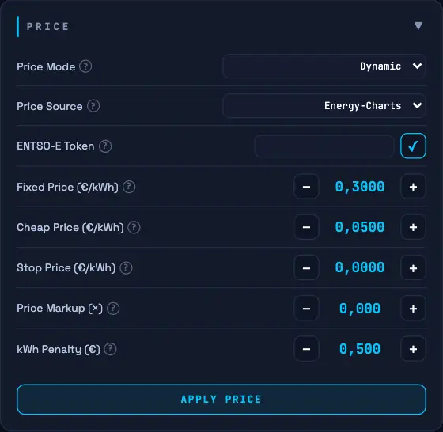

### Price Mode

| Option | When to use |
|--------|------------|
| **Dynamic** | You have a dynamic electricity contract where the price changes every hour. ODIN fetches today's prices automatically and plans heating around the cheapest hours. |
| **Fixed** | You pay a flat rate per kWh. ODIN still optimises around comfort and solar, but all hours are treated as equal cost. |

### Fixed Price (€/kWh)

*Only used when Price Mode is set to Fixed.* The flat electricity price you pay per kWh, e.g. `0.280` for €0.28/kWh.

### Price Source

| Option | Description |
|--------|-------------|
| **Energy-Charts (default)** | Free, no account needed. Covers all supported European zones, **includes tax + VAT** for the selected bidding zone. Recommended for most users. |
| **ENTSO-E** | Official European energy exchange day-ahead data. Requires a free API token. More reliable in some zones. |
| **Manual** | No external fetch — prices must be pushed to ODIN by an external system (e.g. Home Assistant, a script, or a custom integration). See [Section 19](#19-api-data-feeds--pushing-prices--weather) for the endpoint and payload format. |

### Prices Always Valid

The uploaded manual prices become a **permanent daily pattern**: enter them once (e.g. a fixed day/night tariff) and they repeat every day — no daily re-upload. The first 24 uploaded values define the pattern. Leave off to treat each push as a one-off day (+ tomorrow padding).

### ENTSO-E Token

*Only shown when Price Source is set to ENTSO-E.* Your personal API token from the ENTSO-E Transparency Platform. Register for free at [transparency.entsoe.eu](https://transparency.entsoe.eu) and request a Web API security token in your account settings. Format: `xxxxxxxx-xxxx-xxxx-xxxx-xxxxxxxxxxxx`.

### Cheap Price (€/kWh)

Any hour with a price below this threshold is treated as a "cheap" hour. During cheap hours, ODIN applies a very low comfort penalty for running above the target temperature — effectively encouraging pre-heating or aggressive DHW heating whenever prices are very low, even if solar is not available.

The threshold also sets where the **overheat exploit guard** switches on. At negative or near-negative prices ODIN earns money on every kWh it buys, so above the comfort ceiling the penalty grows quadratically instead of linearly — that guard is what stops the optimizer from heating a house it doesn't need to heat just to farm a negative tariff. Because the guard is deliberately harsh, it is scaled by how cheap the hour actually is: **dormant (pure linear penalty) at any price at or above this threshold** — including all fixed tariffs — and ramping to full strength as the price drops below it, reaching full strength at price ≤ 0. This keeps mild afternoon overshoots on a fixed tariff priced as real (mild) discomfort, while deep negative-price hours stay fully protected against the farming exploit.

**Unit:** €/kWh (not €/MWh), all-in consumer price including tax.

| Market / contract | Suggested threshold |
|-------------------|---------------------|
| NL dynamic, typical spread | `0.06` |
| BE / DE with cheap night tariff | `0.05` |
| Area with frequent negative prices | `0.02` |

### Stop Price (€/kWh)

Above this price the solver **stops heating/cooling production** entirely (0 or less = disabled). Hours blocked this way are labelled **Stop price** in the calendar view. Useful with very expensive peak tariffs.

### Price Markup (×)

Multiplier applied to the consumer price to reflect retail tariffs that add a fixed margin on top of the day-ahead price.

### kWh Penalty (€/kWh)

Flat penalty per consumed kWh (e.g. a grid fee). Shifts the solver towards solar and self-consumption. Think of it as a slider between "maximum savings" and "maximum comfort stability":

| Value | Behaviour |
|-------|-----------|
| `0.1` | Very aggressive. Large temperature swings. Maximum cost savings. |
| `0.3` | Recommended for well-insulated or passive houses with UFH. |
| `0.5` | Balanced. Good starting point for most houses. |
| `1.0` | Conservative. Pre-heats only when price difference is large. |
| `2.0` | Minimal optimisation. House stays close to target at all times. |

> **Tip:** Start at `0.5`. Reduce toward `0.3` if your house holds temperature well and you want bigger savings. Increase toward `1.0` if temperature swings feel uncomfortable.

---

## 11. Settings — Schedule

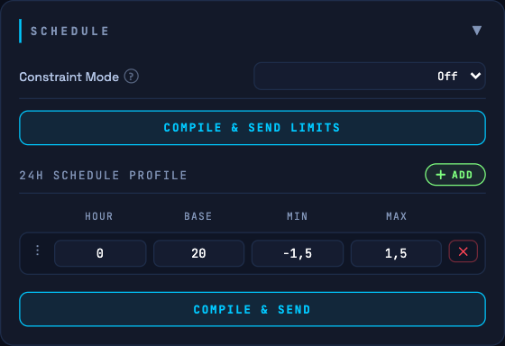

The schedule defines your **comfort temperature band** for each hour of the day. ODIN will never plan to heat above the maximum or let the house cool below the minimum.

### 24h Schedule Profile

The schedule is divided into **time blocks**. Each block defines settings that apply from its start hour until the next block begins. The last block wraps around to midnight.

Each block has four fields:

| Field | Description |
|-------|-------------|
| **Hour** | The hour (0–23) at which this block starts |
| **Base** | Your target ("setpoint") temperature in °C |
| **Min** | Offset below Base that is still acceptable (e.g. `-0.5` means the house can be 0.5°C below Base) |
| **Max** | Offset above Base that is still acceptable (e.g. `+1.5` means the house can be 1.5°C above Base) |

The resulting comfort band is `[Base + Min, Base + Max]`. ODIN plans heating to stay within this band at all times, shifting load to cheaper or solar hours where the band allows.

**Example schedule:**

| Hour | Base | Min | Max | Meaning |
|------|------|-----|-----|---------| 
| 0 | 21.0 | −0.5 | +1.5 | Night: 20.5–22.5°C acceptable |
| 7 | 21.5 | −0.5 | +1.5 | Morning: 21.0–23.0°C acceptable |
| 9 | 22.0 | −0.5 | +1.5 | Day: 21.5–23.5°C acceptable |
| 22 | 21.0 | −0.5 | +1.5 | Evening wind-down |

**Tips for setting the schedule:**

- **Wide bands give ODIN more freedom** to shift heating to cheap/solar hours. A ±1.5°C band is a good starting point.
- **UFH systems** can tolerate wider bands because the floor stores heat. Try Base ± 1.5°C.
- **Radiator systems** react faster and may prefer tighter bands: Base ± 0.5°C.
- **Night setback:** lower the Base by 0.5–1.0°C during sleeping hours if comfort allows. ODIN will plan accordingly.
- **Avoid setting Min = 0** (same as Base). This prevents ODIN from ever letting the house drift slightly cool during expensive hours, which reduces savings potential.

**Managing blocks:** click **ADD** to add a block, edit any field in the row, drag to reorder, **✕** to remove, then **Compile & Send** to save.

### Energy Constraints

The **Schedule Steps** list sets a per-hour cap on either the heat pump's electrical consumption or its thermal output. This is separate from the comfort schedule — where the schedule defines what temperature to maintain, constraints define how hard the heat pump is allowed to work to get there.

**Constraint Mode:**

| Mode | Description |
|------|-------------|
| **Off** | No output restrictions beyond the HP limits. |
| **Consumption Cap** | Caps the heat pump's electrical draw (kW) per the constraint schedule. Useful for homes with a limited grid connection or a smart meter limit. |
| **Output Cap** | Caps the heat pump's thermal output (kW) per the output schedule. Useful for "silent mode" — preventing high output during night hours. |

When a mode other than Off is selected, add one step per period (start hour + maximum kW), drag to reorder, then **Compile & Send Limits**.

> **Note:** Constraints are enforced as hard limits — the solver will never produce a plan that exceeds the limit for a given hour. If the constraint is tighter than what is needed to maintain comfort, ODIN will simply plan less heating for that hour, which may cause the house temperature to drift toward (but not below) the schedule minimum. Hours where the cap left no room are labelled **Power limit** in the calendar.

---

## 12. Settings — DHW & Legionella

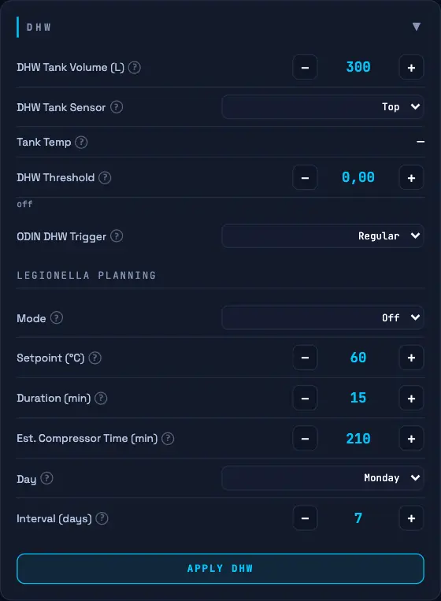

### DHW Tank Volume (L)

The capacity of your domestic hot water tank. ODIN uses this to estimate the energy a scheduled DHW cycle needs, so the DHW cost in the plan is based on your actual tank instead of a guess:

```
heat [kWh] = volume [L] × 4.186 kJ/(L·°C) × ΔT [°C] ÷ 3600
```

where ΔT is the difference between the tank's current temperature and the DHW target. That heat is divided by the heat pump's COP at the planned hour to get the electricity consumption — and therefore the cost — that appears in the plan. A larger tank therefore costs more per DHW cycle, which is exactly what keeps ODIN from scheduling DHW too eagerly.

**Default:** `300`

### DHW Tank Sensor

Chooses which tank temperature ODIN uses for DHW scheduling — the trigger point, the cooling projection, and the energy estimate.

| Option | Meaning |
|--------|---------|
| **Top** | Uses the sensor at the top of the tank only. |
| **Average** | Uses the average of the top and bottom sensors. Requires the pump to report the bottom reading; otherwise the top probe is used. |

Hot water tanks stratify — the water at the top is warmer than the water underneath, so the top probe reads higher than the tank's true average temperature. If you have a secondary (bottom) tank sensor, **Average** is the more representative value.

### DHW Threshold (°C)

If the DHW temperature drops below `(Target − Drop) + Threshold`, ODIN schedules a DHW cycle during an upcoming cheap/sunny hour. **0 = disabled** — the tank then only heats via the pump's own hardware logic.

### ODIN DHW Trigger

The method used when ODIN schedules DHW. `Regular` uses the pump's ECO mode; `Forced` is faster but comes at the cost of higher consumption.

### Legionella Planning

Legionella prevention can be handled in three ways:

| Mode | Meaning |
|------|---------|
| **Off** | Legionella planning disabled. |
| **Odin** | ODIN schedules the 60 °C cycle **itself** and picks the cheapest hour (on the selected day, every X days). |
| **Heatpump** | The heat pump runs its own system cycle on the configured day + time. ODIN does not schedule it, but the plan **marks the window**: no DHW inside, estimated consumption/production added to the plan. |

| Field | Description |
|-------|-------------|
| **Setpoint (°C)** | Target tank temperature for sterilization. Minimum 55°C, recommended 60°C. |
| **Duration (min)** | How long the tank must stay at the setpoint. Minimum 15 minutes. |
| **Est. Compressor Time (min)** | Estimated time the compressor is occupied for the cycle (heating + holding). No cooling/DHW possible during this window. Default 210 min (3.5 h) for a 300 L tank. |
| **Day** | Day of the week to run the cycle. |
| **Interval (days)** | Minimum days between cycles. Prevents running more than once per interval even on the selected day. |
| **System Cycle Start** | Start time of the heat pump's own cycle (Heatpump mode only). ODIN reserves the window in the plan. |

Legionella hours are stamped in the plan with their own calendar reason, so a high price (stop price) never mislabels them — the cycle runs regardless of the price.

---

## 13. Settings — Solar

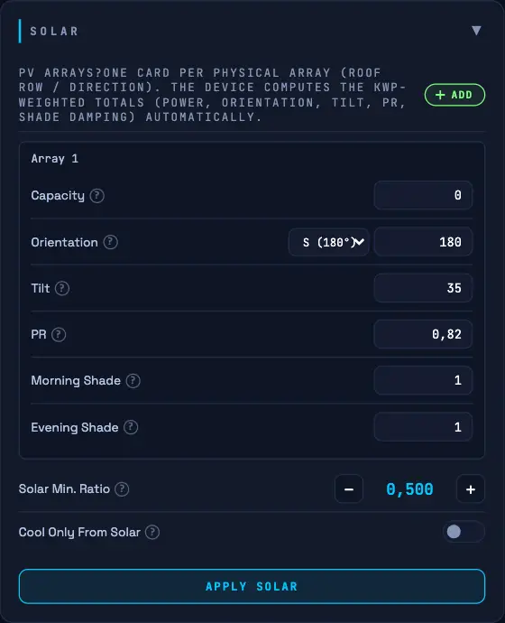

### PV Arrays

One card per physical array (roof row / direction). The device computes the kWp-weighted totals (power, orientation, tilt, PR, shade damping) automatically.

| Field | Description |
|-------|-------------|
| **Capacity (kWp)** | Peak output of the array. During hours when your panels produce more than the heat pump needs, the effective electricity cost drops to near zero — ODIN prefers to run then. |
| **Orientation (Degrees)** | 0 = North, 90 = East, 180 = South, 270 = West. South gives the highest midday output; east/west shift output to morning/afternoon. |
| **Tilt / Pitch (Degrees)** | Flat / low-slope roof: 10–15°. Standard pitched roof: 30–45°. Optimal for NL/BE latitude: ~35°. |
| **Efficiency (PR)** | Performance ratio — inverter efficiency, cable losses, soiling, temperature derating. String inverter ≈ 0.82, micro-inverter ≈ 0.85, central ≈ 0.78–0.80. Default `0.82`. |
| **Morning / Evening Shade** | How much of the *morning* / *evening* output survives the shade. `1.00` = clear sky, `0.50` = half the yield lost, `0.00` = fully blocked. ODIN applies the shade at full strength around sunrise/sunset and fades it to zero at midday — mirroring how a shadow is longest when the sun is low. It only reduces **panel electricity production**; it does not change the passive warmth the sun brings through your windows. |

> **Note:** If the panels have a *clear* horizon but the forecast still overshoots real production, the cause is usually **Capacity (kWp)** or **PR**, not shade — leave the shade factors at `1.00` in that case.

### Solar Min. Ratio (%)

The minimum share of the heat pump's electricity that must be covered by solar before the solver may import cheap grid power. This prevents the heat pump from running at moderate prices just because it "might" be somewhat solar-assisted.

| Setting | Meaning |
|---------|---------|
| `0%` | Solar coverage is ignored. Pre-heating is driven by price only. |
| `100%` | Solar must fully cover the HP before the low penalty applies. |
| `150%` | Solar must be producing 1.5× the HP's estimated draw — a safety margin for solar forecast inaccuracy. |

**Values above 100% are intentionally useful.** Solar irradiance forecasts are estimates, and actual output varies with haze, partial cloud, and panel soiling. Setting 120–150% builds in a buffer so that borderline hours — where the forecast says "just covered" — are not treated as free solar hours when they may not be in practice.

### Cool Only From Solar

When enabled, cooling is only scheduled while solar production covers the consumption. Enable this if you want cooling to be completely free-of-charge (solar-only) and are comfortable with the house running slightly warm during cloudy spells. This setting only affects cooling; heating is unaffected.

---

## 14. Monitoring — Optimization, Physics & Charts

### Optimization Card

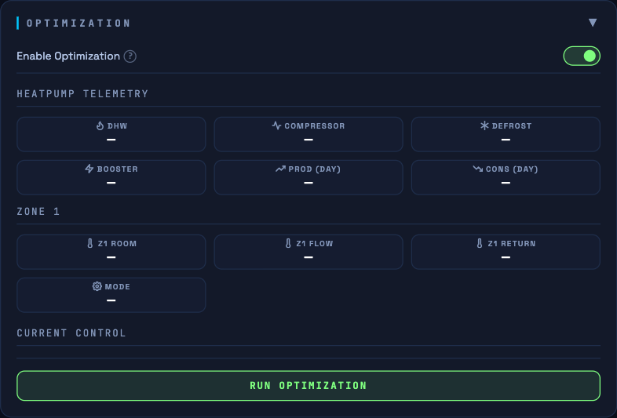

The Optimization card is the solver's control panel and live status:

| Control | Description |
|---------|-------------|
| **Enable Optimization** | Master switch. When on, ODIN runs a solve on its own **every hour — 1 minute before the hour**, after the weather fetch. When off, the last plan stays in effect; "Run Optimization" still works. |
| **Run Optimization** | Runs a full solve immediately — the same one the hourly cron performs, anchored at the next wall-clock hour — so you can see how setting changes affect the plan. The resulting plan is applied like any hourly plan. |
| **Heatpump Telemetry** | Live tiles: DHW, Compressor, Defrost, Booster, daily production/consumption, zone temperatures, flow/return and the current operation mode. |

### Physics Data (Daily Averages)

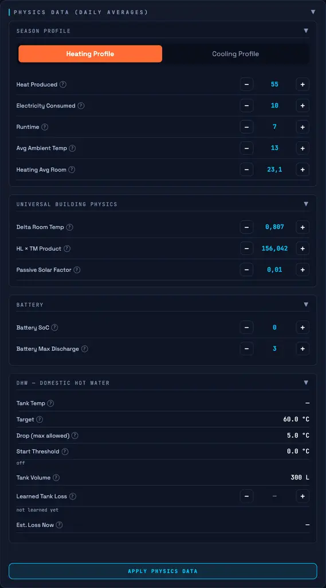

These values are learned automatically from your heat pump's real measured data of the last heating/cooling session and are used by the solver to model your house. The **Season Profile** switch toggles between the Heating and Cooling model. You can override any value manually — ODIN uses your overridden values until the next automatic daily update.

| Field | Description |
|-------|-------------|
| **Heat Produced / Electricity Consumed** | kWh/day and kWh/day of the last heating session (DHW excluded). `COP = Heat / Elec`. |
| **Runtime** | Hours/day the heat pump ran in heating mode. Used to derive thermal mass. |
| **Avg Ambient / Avg Room** | Average outdoor and room temperature on heating days — the pair that determines the heat loss coefficient. |
| **Delta Room Temp** | Max − min room temperature yesterday (daily swing). Small delta = high thermal mass. |
| **Z2 variants** | The same values for zone 2 on two-zone installations (COP Z2, thermal mass Z2, heat loss Z2). |
| **Cooling fields** | The mirrored set for cooling sessions (EER, cooling runtime, cooling ambient/room averages). Kept separate to prevent seasonal drift. |
| **HL × TM Product (Tau)** | Thermal time constant of your house in hours. Higher = house holds heat longer. Learned automatically. Typical: 50–300 h. |
| **Passive Solar Factor** | kWh per W/m² irradiance — heat entering through windows from sunlight, independent of your PV panels. Learned automatically within 0.002–0.030, starting from a conservative default of 0.005. Typical 0.002–0.015. |
| **Battery SoC / Max Discharge** | Current battery charge (kWh) and maximum discharge rate (kW). The solver assigns discharge to the most expensive HP hours. Set SoC `0` if you have no battery. |
| **DHW block** | Live effective tank temperature, target, max allowed drop, start threshold and tank volume as the solver sees them. |
| **Learned Tank Loss (1/h)** | The tank cooling constant (U·A/C): the tank loses `k × (tank − ambient)` °C per hour, learned from measured tank drift. **Est. Loss Now** converts it to °C/h at the current temperatures — this is the rate the DHW trigger timing uses. Until enough cooling intervals are observed, ODIN falls back to a generic 0.5 °C/h. |

**Typical values** (for sanity-checking what ODIN learned):

| Heat Produced (kWh/day) | Winter | Spring |
|--------------------------|--------|--------|
| Small apartment | 15–25 | 5–10 |
| Average house | 30–60 | 10–25 |
| Large passive house | 20–40 | 5–15 |

| Delta Room Temp (daily swing) | House type |
|-------------------------------|------------|
| 1.5–3.0°C | Light timber frame, radiators |
| 0.8–1.5°C | Average brick house |
| 0.2–0.6°C | Heavy concrete, UFH |
| 0.1–0.3°C | Near-passive / passive house |

| Passive Solar Factor | House type |
|----------------------|------------|
| 0.002 | No south-facing windows, heavily shaded |
| 0.003–0.006 | Normal house, some south glass |
| 0.006–0.010 | Modern house, good south glazing |
| 0.010–0.020 | Large house, many large south windows |
| 0.020–0.030 | Near-passive with extensive south glazing |

Values are learned within a hard 0.002–0.030 envelope and start at 0.005
on a new install: the factor is physically bounded by your glass area ×
SHGC (a house with 20 m² of south glass at SHGC 0.7 is ~0.014), and an
over-estimated factor makes the solver idle through cold hours banking on
free sun that never shows up.

| Battery Max Discharge | Battery system |
|-----------------------|----------------|
| 2.5–3.0 kW | Typical home battery (~5 kWh) |
| 5.0–7.5 kW | Larger system (10+ kWh) |

Derived values are shown in the **Debug JSON** rather than as editable fields: `used_heat_loss` (kW/K, learned by the day method — heat produced divided by the indoor/outdoor difference of the last heating day), `used_heating_cop` and the thermal-mass figures.

### Charts

- **Room Temperatures (24h)** — scheduled band, ODIN's expected temperatures and the actual curve. A coloured strip hovering above the highest visible line shows the mode that actually ran each hour; the x-axis label colours show the *planned* mode. Click-drag to zoom, **Reset Zoom** to undo.
- **Consumption / Production / Cost** — planned electricity draw, thermal output and expected cost per hour.
- **Battery Discharge Plan (24h)** — the recommended discharge per hour (recommendation only, see [Section 18](#battery-integration-recommendation-only)).
- **Electricity Prices (24h)** and **Weather Forecast & Solar Irradiance (24h)** — the inputs of the current plan.

### Calendar — why the solver did (or didn't) run

Switch the Monitoring view to **Calendar** and open any hour to see *why* the solver planned it that way. The reason is read straight from the solver's own cost calculation for that hour — never guessed afterwards — so it can never disagree with the plan.

| Reason | Meaning |
|--------|---------|
| **Coasting** | The heat pump was off because doing nothing was cheaper than running — the house could coast on stored heat. |
| **Comfort (limit)** | The house was at or past the edge of your comfort band, so the hard comfort penalty forced the pump to run regardless of price. |
| **Comfort (drift)** | Inside the comfort band, but the room is on the uncomfortable side of your target temperature — too warm when cooling, too cold when heating. The solver ran to hold or recover that position and stay ahead of a future hard-limit hit. This is the most common reason on a normal day. |
| **Buffering (cheap energy)** | The pump ran even though comfort did not ask for it. The room is on the *far* side of your target because a low grid price now beats paying for the same energy in a more expensive hour later. |
| **Buffering (solar)** | Same, but specifically because your PV array is covering the draw right now. |
| **Modulation / Wear** | The load level was chosen for part-load efficiency rather than price or comfort. |
| **Energy price** | No other factor dominated — simply the cheapest hour to buy the kWh needed. |
| **Hot water** | Hour reserved for a domestic hot water (DHW) heating cycle. |
| **Legionella** | Hour reserved for the legionella cycle (ODIN-planned slot or the pump's own system-cycle window). |
| **Stop price** | Blocked: the price was at or above your **Stop Price** setting, so grid use was forbidden this hour. |
| **Solar-only** | Blocked: **Cool Only From Solar** is enabled and there wasn't enough sun. |
| **Power limit** | Blocked: your configured **energy constraint** (Consumption / Output Cap) left no room this hour. |

The last three ("blocked") reasons are worth noticing specifically — they mean the solver *wanted* to run but a setting stopped it, which is different from voluntarily coasting. If the house is drifting cold and the calendar keeps showing one of these, that setting is the first place to check.

**Reading "Comfort (drift)" vs "Buffering".** These are ranked by *necessity*, not by which cost was biggest, and the giveaway is where the room sits relative to your target line on the chart:

- On the uncomfortable side of the target → **Comfort (drift)**. The pump had to run; a low price or free solar may well have made it cheap, but it was not the reason.
- On the far side of the target → **Buffering**. Comfort was already satisfied and the solver deliberately overshot to bank energy, either because PV covered it (**Buffering (solar)**) or because the grid price was simply good right now (**Buffering (cheap energy)**).

### What good performance looks like

- **Actual closely follows Expected** — the physics model is accurate.
- **Actual stays within the comfort band** — the solver is meeting its comfort constraints.
- **Expected rises during sunny hours without HP running** — passive solar gain is correctly modelled.
- **Expected dips slightly during expensive hours, then recovers** — heating is being shifted to cheap periods.
- It is normal that Actual and Expected sometimes do not perfectly match: opening a window, cooking, extra people or a fireplace change the temperature in ways no model can foresee. ODIN adjusts the plan for the next hour, and predictions keep improving after a few days of heating or cooling.

### What to look for when tuning

**Actual consistently higher than Expected:** The house is better insulated than the model thinks — Tau slightly underestimated. Safe, self-corrects.

**Actual consistently lower than Expected:** The house loses heat faster than modelled, or there is an unmeasured draught. Consider raising the **kWh Penalty** to plan more conservatively.

**Expected is flat during sunny hours:** The **Passive Solar Factor** may be too low. Increase slightly and monitor over a few days.

**Expected shows large swings between hours:** The comfort band may be too wide, or the kWh Penalty too low. Try 0.5–0.7 for more stable planning.

**Actual drops below Schedule Min:** The solver underestimated heat loss or overestimated solar gain. Check that Tau is realistic for your house type, and check the calendar reasons — "blocked" hours point straight at the responsible setting.

---

## 15. Data Tab

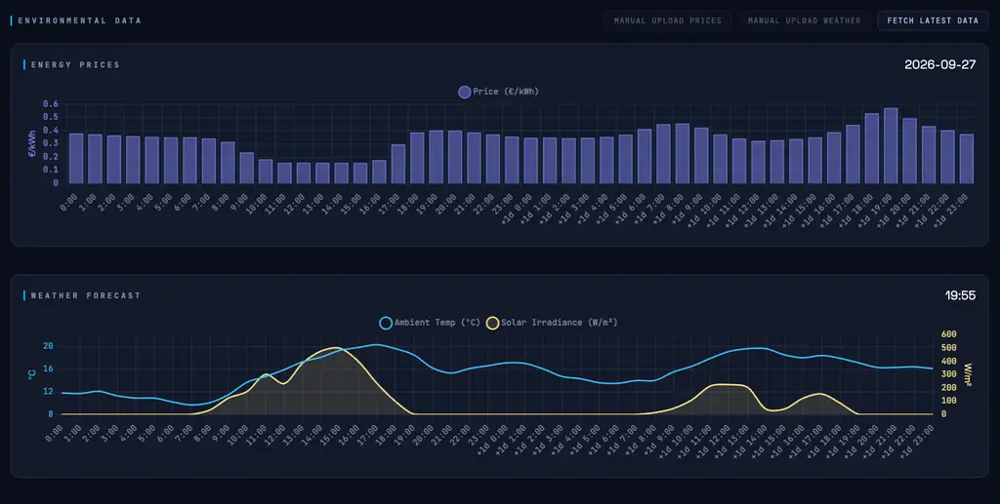

The **Data** tab shows the raw inputs ODIN is working with. Both charts display **48 hours**: today's 24 hours followed by tomorrow's (`+1d 0:00` … `+1d 23:00`) — the full window the solver plans over.

- **Energy Prices** — hourly all-in prices in €/kWh. Tomorrow's prices appear once published (typically from around 13:00 CET). If prices show `0` for all hours, click **Fetch Latest Data**.
- **Weather Forecast** — hourly outdoor temperature (°C) and solar irradiance (W/m²) for both days, with the timestamp of the last fetch.

Click **Fetch Latest Data** to immediately refresh both prices and weather. This is useful after changing your location or sources in Settings — always verify here that the correct data loads before relying on it for overnight planning.

ODIN fetches automatically as well: the first attempt for tomorrow's day-ahead prices runs at **14:15 CET** (when the exchanges publish them), with retries at :15/:45 as long as prices are still missing; weather refreshes every hour at :55, just before the hourly solve.

---

## 16. System Tab

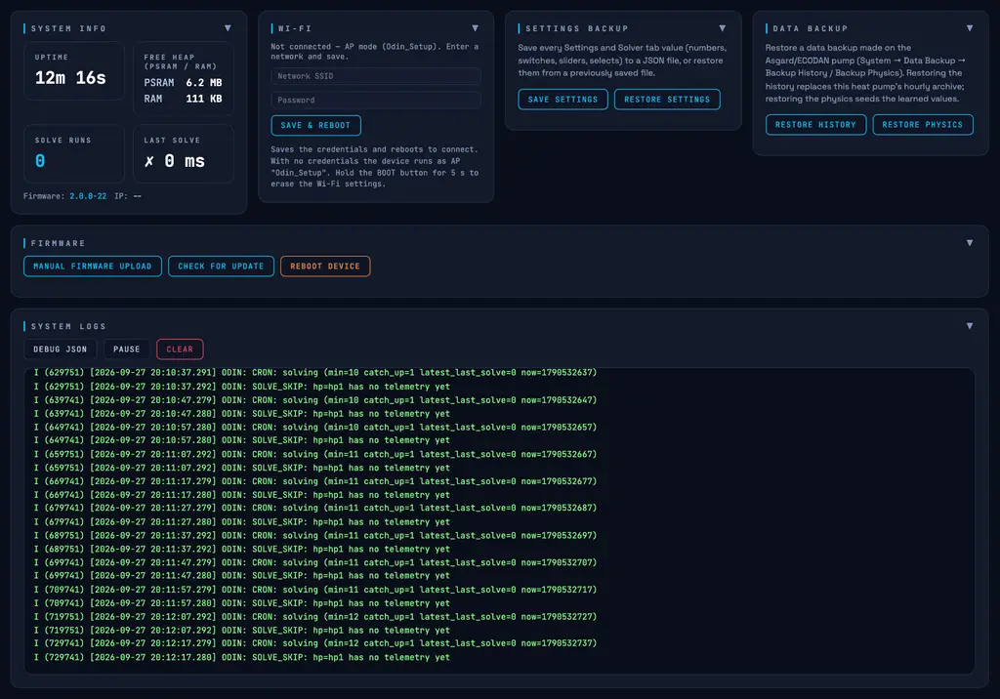

| Section | Description |
|---------|-------------|
| **System Info** | Uptime, free heap (PSRAM / RAM), solve runs, last solve duration, firmware version and IP. |
| **Wi-Fi** | Enter your network's SSID and password and click **Save & Reboot** to connect. With no credentials the device runs as AP `Odin_Setup`. Hold the **BOOT** button for 5 s to erase the Wi-Fi settings. |
| **Settings Backup** | Save every Settings/Solver value (numbers, switches, sliders, selects) to a JSON file, or restore from a previously saved file. |
| **Data Backup** | Restore a data backup made on an Asgard/ECODAN pump (System → Data Backup → Backup History / Backup Physics). Restoring the history replaces this heat pump's hourly archive; restoring the physics seeds the learned model values — useful when migrating from Asgard to ODIN. |
| **Firmware** | **Check for Update** queries the latest GitHub release and flashes the matching `.ota.bin` asset automatically. **Manual Firmware Upload** flashes a `.bin` you downloaded from the releases page yourself (upload takes 20–60 s). **Reboot Device** restarts ODIN. ⚠️ **Do not power off the device during an update.** |
| **System Logs** | Live scrolling log. **Debug JSON** downloads the last solve request and response payload — the primary tool for troubleshooting. **Pause** freezes the display without stopping logging; **Clear** resets the buffer. |

---

## 17. The Pump Side — Asgard & HeishaMon

ODIN does not speak the heat pump bus itself. A small pump-side device does. Currently supported: **Asgard** and **HeishaMon**; more devices will follow.

- **Asgard** (recommended) — an ESPHome firmware for a second ESP32 connected to the Ecodan/CNB5 bus. It publishes all telemetry (temperatures, energy counters, operation mode, DHW tank probes) to MQTT and executes ODIN's commands. It has its own web dashboard at its own IP.

The only contract that matters: **the pump-side device must publish and subscribe on the same broker (and topic prefix) as ODIN** — see [Section 7](#7-settings--mqtt) and [Section 20](#20-mqtt-integration). If it cannot join the broker, use the **HP Command URL** HTTP fallback instead.

- **HeishaMon** — ODIN also understands HeishaMon's native `main/+` message stream on the configured HP prefix. Commands still require either the shared broker or the HP Command URL.

### Required pump-side control modes

ODIN commands the **flow temperature** directly, and that only works when the pump is set up for it. One table, both brands:

| Pump side | Heating | Cooling |
|-----------|---------|---------|
| **Asgard** (Ecodan/Zubadan) | Zone mode **Heat Flow Temp** | Zone mode **Cool Flow Temp** (requires a unit with the cooling option) |
| **HeishaMon** (Panasonic Aquarea) | **Heating Mode = Direct** (not the compensation curve) **and** **Z1 Sensor Settings = Water** (not thermostat/thermistor) | **Cooling Mode = Direct** (direct cool temperature, not the cool curve) |

In these modes ODIN's temperature commands are absolute flow temperatures (≈20–60 °C) — the same control surface Asgard's own optimizer uses. Wrong mode means wrong control:

- **Asgard in `Room Temp` or `Compensation Curve` mode:** ODIN's flow commands are ignored — a room-temp zone is owned by its thermostat, and a curve shift (−5..+5) is not a flow temperature.
- **HeishaMon in curve mode (Heating Mode = Compensation):** ODIN refuses to send anything rather than guessing; there is no absolute flow-temperature command in that mode.
- **HeishaMon in direct mode with a thermostat/thermistor sensor:** still supported — ODIN then writes the flow target into the high point of the heat curve instead of the direct temperature topic.

> **Tip:** On HeishaMon, check the two settings under *Advanced settings* on the HeishaMon web UI (or via the `main/Heating_Mode` and `main/Z1_Sensor_Settings` topics) before blaming ODIN for a plan that never executes — with the settings unknown or wrong, ODIN deliberately sends nothing.

### Settings on Asgard that shape what ODIN sees

These live on Asgard's own dashboard, not on ODIN:

| Setting | Effect on ODIN |
|---------|----------------|
| **Room Temperature Source** | Which temperature rides the telemetry as the room temperature: the heat pump's room thermostat, an external sensor, or a virtual thermostat. Choose the one that represents the space you want planned — buffer-tank installs should use the virtual thermostat. |
| **Heating System Type** | `UFH` / `UFH + Radiators` / `Radiators`. Drives Asgard's local flow control (how fast it moves the flow setpoint); the ODIN solver itself learns the house behaviour from data. |
| **Energy Meter Source** | `Internal Energy Meter` or `Home Assistant or REST API`. On the API option, the daily consumption forwarded to ODIN is the **kWh meter feedback** value (a real energy meter fed from HA/REST) instead of the pump's internal counter — the accurate source on controllers with coarse/daily energy counters. The selection applies to both the forwarded telemetry and Asgard's own display; a missing feedback value is forwarded as unknown rather than silently falling back to the internal counter, so the two counters never mix within a day. |

---

## 18. How the Optimizer Works

This section gives a plain-language overview of how ODIN plans. You do not need to read it to use ODIN, but it can help explain why the system behaves the way it does.

### Planning ahead

Five minutes before each hour, ODIN builds a complete plan for the next **48 hours**. It looks at all the information available — electricity prices, weather forecast, solar production, your current room and tank temperatures, and your comfort schedule — and decides how much to heat or cool each upcoming hour to minimise cost while staying within your comfort band.

Rather than reacting hour by hour, ODIN thinks several steps ahead. This is what allows it to pre-heat during a cheap morning window to avoid running during an expensive evening peak, and to correctly account for how the house will cool down naturally in the hours in between. Between the hourly plans, a fast adaptive loop corrects the actual command within minutes whenever real telemetry deviates from the plan.

### Learning your house

ODIN automatically learns how your house behaves from real daily measurements:

- **How fast it loses heat** — derived from the last heating session: heat produced, divided by the indoor/outdoor temperature difference over that session.
- **How much heat the structure stores** — derived from how slowly the house cools down when the heat pump is off (the daily room-temperature swing).
- **How much free solar heat enters through windows** — derived from periods when the sun is shining and the heat pump is off.
- **How fast your hot-water tank cools** — derived from tank drift between heating cycles, against the outdoor temperature.

These values improve over the first week of operation and continue to self-correct as conditions change across seasons. Every learned value is visible (and editable) in the Physics Data card.

### What it optimises for

Each hourly plan balances three things simultaneously:

**Cost** — electricity is priced differently each hour. ODIN runs the heat pump harder during cheap hours (especially solar hours where grid cost approaches zero) and less during expensive hours, as long as your comfort limits allow.

**Comfort** — the plan generally stays within your schedule's min/max temperature band. ODIN will almost never let the house drop below your minimum or heat it beyond your maximum, regardless of price. *Exception: in shoulder months (mild weather), in case of solar irradiance, the solver might allow the temperature to dip slightly below the minimum band if it expects to be able to recover this within a few hours.*

**Heat pump health** — frequent compressor starts and sustained very-high or very-low loads are gently discouraged. ODIN prefers steady, efficient operation over rapid cycling.

### DHW Scheduling

ODIN is fully aware of your Domestic Hot Water (DHW) needs. Rather than letting the heat pump blindly reheat the tank whenever it drops, ODIN's optimization engine tries to schedule this heavy energy load during the cheapest or sunniest hours.

How this behaves depends on three variables: your **Target** (Setpoint), your hardware **Drop**, and ODIN's **Threshold**.

#### Example Numbers
To understand when ODIN triggers a DHW run, let's look at a tested setup with a 300L tank:
* **Target Setpoint:** 48°C
* **Hardware Drop:** 10°C (The limit where the heat pump *must* start)
* **ODIN Threshold:** 8.5°C (ODIN's planning buffer)

Using these numbers, we get two critical trigger points:
1. **The Hardware Minimum:** `Target - Drop` (48 - 10 = **38°C**). If the water hits this temperature, the heat pump ignores all schedules and starts heating immediately to protect your comfort.
2. **The ODIN Trigger:** `Hardware Minimum + Threshold` (38 + 8.5 = **46.5°C**). This is the temperature at which ODIN starts looking for a smart heating slot.

#### How the Algorithm Schedules the Slot
At the start of every hour, ODIN's optimization engine checks the current tank temperature.

1. **Triggering the search:** As soon as the tank drops below the ODIN Trigger (e.g., someone washes their hands and it drops to 46.0°C), ODIN knows a DHW run will be needed soon.
2. **Finding the best slot:** The algorithm scans the upcoming hours in its planning window. It looks for the cheapest available spot—usually an hour with high solar coverage or very low grid prices—*before* it expects the tank to drop all the way to 38°C.
3. **Locking it in:** Once the optimal hour is found, the engine **locks in the DHW run first**. Because DHW requires the heat pump to run at high temperatures (meaning space heating is paused), ODIN secures the DHW slot and then builds the rest of the space-heating plan around it to ensure they do not clash. In a two-zone home the shared tank slot is planned once, for the whole house.

#### Energy Estimate for the Locked Slot

Once a slot is locked, ODIN estimates how much electricity that DHW cycle will draw and reflects it in the plan. The estimate is based on the **DHW Tank Volume**:

```
heat [kWh] = volume [L] × 4.186 kJ/(L·°C) × ΔT [°C] ÷ 3600
```

where ΔT is the difference between the tank's current temperature and the DHW target. That heat is divided by the heat pump's COP at the planned hour (a warmer source means a higher COP) to get the electricity consumption — and cost — of that hour. This is why a larger tank produces a higher estimated cost per DHW cycle, and why the number tracks your actual tank instead of a fixed value.

#### How ODIN Foresees Tank Cooling

How urgently a DHW slot is needed depends on how fast the tank cools down. ODIN does not assume a fixed rate: it **learns your tank's cooling behaviour** by observing the tank temperature over intervals in which neither DHW nor legionella heating is running, and fitting a cooling constant against the outdoor temperature. This makes the projection season-aware — the same tank cools much faster in January than in March, because the gap to the outdoor temperature is larger.

The constant needs a handful of valid cooling intervals (roughly a day of hourly solves) before ODIN starts using it. Until then — and again for about a day after a factory reset or reflash — ODIN falls back to a generic 0.5 °C per hour. The learned value is stored on the device, so a normal restart loses nothing. It is shown as **Learned Tank Loss** in the Physics Data card, and the per-hour rate it implies as **Est. Loss Now**.

#### Dynamic Adjustments & Hardware Overrides
Because ODIN recalculates every hour, the plan is highly dynamic. If ODIN schedules a DHW run for 14:00 (the cheapest solar hour), but someone takes a 15-minute shower at 11:00, the algorithm will instantly recalculate at 12:00 to see if it needs to move the heating slot closer.

**The Hardware Override:** ODIN can only optimize what it can foresee. If someone takes a massive, long shower and drains the tank rapidly down to the hardware minimum, the physical drop point is reached. At this point, the heat pump starts automatically to recover the tank. ODIN cannot prevent this hardware safety mechanism, meaning that specific run will happen regardless of the current electricity price.

#### Opportunistic "Free" Heating
If electricity prices drop below zero (negative pricing), the algorithm overrides the normal threshold logic. It will opportunistically top up the hot water tank to its maximum target—even if the tank is only slightly depleted—because heating at that exact moment is genuinely free (or even pays you).

### Legionella Scheduling

With legionella mode set to **Odin**, the solver plans the 60 °C sterilization cycle itself: on the configured day, provided the minimum interval has passed, it evaluates every candidate hour of the planning window (price × estimated compressor energy, respecting the duration and compressor-time reservation) and books the cheapest one. The reserved window blocks DHW and cooling. With mode **Heatpump**, the pump runs its own cycle; ODIN doesn't schedule it but reserves the window in the plan with estimated consumption/production, so the rest of the day stays coherent. In both cases the hours carry the **Legionella** calendar reason.

### Battery integration (Recommendation Only)

If you have a home battery, ODIN calculates how to best allocate your available battery charge to the most expensive heating hours of the day, within the discharge limit you have set. This reduces the estimated grid draw during price peaks and is factored into the cost forecast shown after each solve.

**Note:** ODIN currently only generates a discharge *schedule and recommendation*. It does not actively integrate with or control your battery hardware (yet). To actually discharge your battery according to this plan, you will need to use an external automation platform (like Home Assistant) to read ODIN's planned consumption (via MQTT or the `/api/debug` JSON) and control your battery accordingly.

---

## 19. API Data Feeds — Pushing Prices & Weather

ODIN supports two HTTP POST endpoints that let an external system — such as Home Assistant, a Node-RED flow, or any script — push electricity prices and weather data directly to the device. This replaces the built-in automatic fetchers entirely and is useful when:

- You have a non-European energy contract or a custom tariff structure not supported by Energy-Charts or ENTSO-E
- You want to feed real sensor data (outdoor temperature from a local weather station, actual PV inverter output) instead of forecast estimates
- You integrate ODIN into a broader home automation platform that already aggregates this data

Both modes store their last payload in flash, so ODIN restores the pushed data automatically after a reboot without needing an immediate re-push.

### Activating API Mode

Before pushing data, set the corresponding source to **Manual** in the Settings tab:

- **Prices:** set **Price Source** → `Manual`
- **Weather:** set **Weather Source** → `Manual`

Once active, ODIN's background scheduler will no longer overwrite the pushed data with automatic fetches.

> **Important:** In manual price mode, ODIN expects **all-in consumer prices** (spot price + energy tax + VAT already included) in €/kWh. The tax conversion that ODIN normally applies automatically is skipped for API-pushed prices.

### POST /api/data/prices

Pushes 24–48 hours of hourly electricity prices to ODIN.

**URL:** `http://<odin-ip>/api/data/prices` — **Method:** `POST` — **Content-Type:** `application/json`

```json
{
  "prices": [0.21, 0.19, 0.18, 0.17, 0.16, 0.15, 0.14, 0.13,
             0.15, 0.22, 0.28, 0.31, 0.29, 0.26, 0.24, 0.23,
             0.25, 0.30, 0.35, 0.38, 0.34, 0.28, 0.24, 0.22,
             0.20, 0.18, 0.17, 0.16, 0.15, 0.14, 0.13, 0.12,
             0.14, 0.21, 0.27, 0.30, 0.28, 0.25, 0.23, 0.22,
             0.24, 0.29, 0.33, 0.36, 0.32, 0.27, 0.23, 0.21]
}
```

| Field | Type | Required | Description |
|-------|------|----------|-------------|
| `prices` | array of floats | Yes | Hourly all-in electricity prices in **€/kWh**, starting from hour 0 of today. Minimum 24 values; 48 recommended. |

**Rules:**

- Values must be in **€/kWh** including all taxes and VAT — not €/MWh raw spot prices.
- At least **24** values are required. Fewer returns HTTP 400.
- If fewer than 48 values are supplied, the remaining hours (tomorrow) are padded with the average of the supplied prices.
- With the **Prices Always Valid** toggle on, the first 24 values are stored as a permanent repeating daily pattern — ideal for fixed day/night tariffs: push once, never again.
- Prices are written to flash immediately and survive a reboot.

**Success response:** `{ "success": true }`

**Home Assistant example (RESTful command):**

```yaml
rest_command:
  push_odin_prices:
    url: "http://192.168.1.42/api/data/prices"
    method: POST
    content_type: "application/json"
    payload: >
      {"prices": {{ prices_list | tojson }}}
```

### POST /api/data/weather

Pushes 24–48 hours of hourly outdoor temperature and solar irradiance to ODIN.

**URL:** `http://<odin-ip>/api/data/weather` — **Method:** `POST` — **Content-Type:** `application/json`

```json
{
  "temps": [8.1, 7.6, 7.2, 6.9, 6.7, 6.5, 6.8, 7.4,
            8.3, 9.5, 10.8, 11.9, 12.6, 12.9, 12.7, 12.1,
            11.3, 10.4, 9.8, 9.3, 9.0, 8.7, 8.5, 8.2,
            8.0, 7.5, 7.1, 6.8, 6.6, 6.4, 6.7, 7.3,
            8.2, 9.4, 10.7, 11.8, 12.5, 12.8, 12.6, 12.0,
            11.2, 10.3, 9.7, 9.2, 8.9, 8.6, 8.4, 8.1],
  "solar": [0, 0, 0, 0, 0, 0, 0, 15,
            95, 210, 340, 430, 480, 460, 400, 310,
            200, 90, 20, 0, 0, 0, 0, 0,
            0, 0, 0, 0, 0, 0, 0, 18,
            100, 215, 345, 435, 485, 465, 405, 315,
            205, 95, 22, 0, 0, 0, 0, 0]
}
```

| Field | Type | Required | Description |
|-------|------|----------|-------------|
| `temps` | array of floats | Yes | Hourly outdoor air temperature in **°C**, starting from hour 0 of today. Minimum 24 values; 48 recommended. |
| `solar` | array of floats | Yes | Hourly solar irradiance in **W/m²**, plane-of-array (POA) — already corrected for your panel tilt and orientation. Minimum 24 values; 48 recommended. Negative values are clamped to 0. |
| `wind` | array of floats | No | Hourly wind speed in m/s (used for the wind COP correction). Missing hours default to a calm 2.0 m/s. |

**Rules:**

- Both `temps` and `solar` must be present; at least **24** values each, otherwise HTTP 400.
- Missing hours are padded: temperature with the array average, solar with `0` (safest assumption).
- Solar values are irradiance in **W/m²**, not production in kWh. ODIN multiplies by your configured array capacity and PR to derive expected hourly production.
- If you are supplying data from a local weather station that measures horizontal (GHI) irradiance rather than tilted-plane (POA), you will need to transpose it yourself before pushing — or use the Open-Meteo automatic source which performs this server-side.
- Data is written to flash immediately and survives a reboot.

**Success response:** `{ "success": true }`

**Home Assistant example:**

```yaml
rest_command:
  push_odin_weather:
    url: "http://192.168.1.42/api/data/weather"
    method: POST
    content_type: "application/json"
    payload: >
      {"temps": {{ temps_list | tojson }}, "solar": {{ solar_list | tojson }}}
```

### Error responses

| Code | Meaning |
|------|---------|
| `400 Bad Request` | Malformed JSON, missing array field, or fewer than 24 values supplied |
| `408 Request Timeout` | Connection dropped during upload |
| `500 Internal Server Error` | Device out of memory (should not occur under normal conditions) |

### Scheduling pushes

Both endpoints are stateless — push whenever your data updates:

- **Prices:** push once daily, shortly after day-ahead prices are published (typically 13:00–14:00 CET). Push 48 values covering today and tomorrow — or turn on **Prices Always Valid** for a fixed pattern and push once.
- **Weather:** push once per hour (or every 30 minutes) so ODIN always has the freshest forecast before its hourly solve. Each push overwrites the previous data.

> **Tip:** In Home Assistant, a Time-based automation that calls `rest_command.push_odin_prices` at 14:15 and `rest_command.push_odin_weather` every hour on the :55 mark (five minutes before ODIN's hourly solve) is a reliable and low-overhead integration pattern.

---

## 20. MQTT Integration

With the default topic prefix `hp` and heat-pump id `hp1`:

| Direction | Topic | Content |
|-----------|-------|---------|
| Pump → ODIN | `hp/hp1/telemetry` | Full heat pump telemetry: temperatures, energy counters, operation mode, DHW probes. Published by the pump-side device (Asgard or HeishaMon). |
| Pump → ODIN | `hp/hp1/info` | Device info (opaque). |
| Pump → ODIN | `hp/hp1/room_temp/<zone>` | Zone thermostat temperatures (independent channels, own timestamps). |
| ODIN → Pump | `hp/hp1/commands/setpoint` | The commanded setpoint/operation for the current plan hour. |
| ODIN → broker | `odin/solver/result/hp1` | The full solver result (plan, prices, reasons) — retained, so a late-subscribing dashboard sees the current plan immediately. |
| ODIN → broker | `odin/status` | Retained `online` presence of ODIN itself. |
| HeishaMon → ODIN | `<hp_prefix>/main/+` | HeishaMon's native message stream. |

**Home Assistant:** point HA at the same broker (or at the ODIN's IP when using the **embedded broker**), then subscribe to the telemetry and `odin/solver/result/+` topics — they double as sensor sources. Commands from HA should go through the same `commands/setpoint` topic the solver uses.

**Debug:** `GET /api/debug` returns the last solve request/response payload; `GET /api/stats`, `/api/version`, `/api/config`, `/api/physics`, `/api/forecast`, `/api/logs` expose live state, and `POST /api/solve` triggers a solve over HTTP.

---

## 21. Quick-Start Checklist

Use this checklist after first-time setup to confirm everything is configured correctly:

- [ ] ODIN is connected to your home Wi-Fi (dashboard loads via local IP)
- [ ] Setup Wizard completed — or all setting areas manually configured
- [ ] **MQTT**: pump-side device and ODIN reach the **same broker** (or HP Command URL configured) — the HP badge in the header shows **Online**
- [ ] **Latitude** and **Longitude** are set to your location
- [ ] **Bidding Zone** matches your country
- [ ] **Price Mode** is set to Dynamic (if you have a dynamic contract)
- [ ] **Solar arrays** configured (or solar off)
- [ ] **Max / Min Thermal Output** match your heat pump's datasheet
- [ ] **kWh Penalty** is set (start with `0.5`)
- [ ] **24h Schedule** has at least one block with sensible temperature targets
- [ ] **DHW**: tank volume, sensor and threshold set; legionella mode chosen
- [ ] Go to the **Data** tab and click **Fetch Latest Data** — verify prices and weather load correctly
- [ ] Go to the **Monitoring** tab — after the next hour, the plan and chart show a successful solve

---

## 22. Factory Reset

To restore ODIN to its original settings:

1. Press and hold the **BOOT** button.
2. Keep holding while the LED warns (red) at ~4 s — continue.
3. After **5 seconds** the LED flashes rapidly and the device erases its Wi-Fi credentials and all configuration.

ODIN reboots into access-point mode (`Odin_Setup`). Repeat the [First Boot](#4-first-boot--wi-fi-setup) steps — connect to the AP, set Wi-Fi — and then run the [Setup Wizard](#5-setup-wizard) again. Learned physics and hourly history are kept; use the **System → Settings Backup** to keep a portable JSON copy of all settings, and **System → Data Backup** to restore history/physics from an older Asgard backup.
